# 対象
- Email通知以外の方法で利用料確認をしたい人

# Slack 通知を設定しよう！

一定額超えたら、Slack に通知するようにすれば、早めに気づけるという結論に至ったので設定してみました。

マイ請求ダッシュボードの AWS Budgets から『予算を作成』をクリックします。

[billing/home#budgets](https://console.aws.amazon.com/billing/home#/budgets)


『予算タイプの選択』を『コスト予算』にします。


AWS チャットボットのアラートというのを設定しないと、Slack 通知ができないので、次はそちらを設定します。

# AWS Chatbot の設定

AWS Chatbot にアクセスします。
[chatbot/home#/home](https://us-east-2.console.aws.amazon.com/chatbot/home#/home)

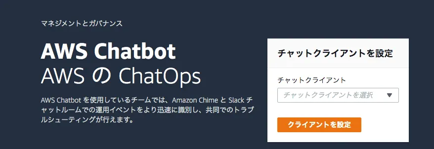

チャットクライアントを Slack に設定し、自身の作成した Slack のワークスペースと連携します。
連携が終わると、以下の画面に遷移します。


新しいチャンネルを設定するためには既に作成されたSNSが必要なので、次はSNSを設定します。

## SNS の設定

Amazon Simple Notification Service にアクセスします！
[sns/v3/home?region=ap-northeast-1#/homepage](https://ap-northeast-1.console.aws.amazon.com/sns/v3/home?region=ap-northeast-1#/homepage)


トピック名を適当に作成し、次のステップに移ります。

SNS は AWS Budgets から実行したいので、アクセスポリシーを修正します。
デフォルトでは以下のようになってます (メソッドを『高度な』に変えると JSON エディタが開きます)。

```yaml
{
  "Version": "2008-10-17",
  "Id": "__default_policy_ID",
  "Statement":
    [
      {
        "Sid": "__default_statement_ID",
        "Effect": "Allow",
        "Principal": { "AWS": "*" },
        "Action":
          [
            "SNS:Publish",
            "SNS:RemovePermission",
            "SNS:SetTopicAttributes",
            "SNS:DeleteTopic",
            "SNS:ListSubscriptionsByTopic",
            "SNS:GetTopicAttributes",
            "SNS:Receive",
            "SNS:AddPermission",
            "SNS:Subscribe",
          ],
        "Resource": "arn:aws:sns:ap-northeast-1:<マイアカウントの番号>:<トピック名>",
        "Condition":
          { "StringEquals": { "AWS:SourceOwner": "<マイアカウントの番号>" } },
      },
    ],
}
```

AWS Budgets から SNS を push するように、これを Statement に追加します。

```yaml
{
  "Sid": "AWSBudgets-notification-1",
  "Effect": "Allow",
  "Principal": { "Service": "budgets.amazonaws.com" },
  "Action": "SNS:Publish",
  "Resource": "arn:aws:sns:ap-northeast-1:<マイアカウントの番号>:<トピック名>",
}
```

最終的にこうなります。

```yaml{6-12}
{
  "Version": "2008-10-17",
  "Id": "__default_policy_ID",
  "Statement":
    [
      {
        "Sid": "AWSBudgets-notification-1",
        "Effect": "Allow",
        "Principal": { "Service": "budgets.amazonaws.com" },
        "Action": "SNS:Publish",
        "Resource": "arn:aws:sns:ap-northeast-1:<マイアカウントの番号>:<トピック名>",
      },
      {
        "Sid": "__default_statement_ID",
        "Effect": "Allow",
        "Principal": { "AWS": "*" },
        "Action":
          [
            "SNS:Publish",
            "SNS:RemovePermission",
            "SNS:SetTopicAttributes",
            "SNS:DeleteTopic",
            "SNS:ListSubscriptionsByTopic",
            "SNS:GetTopicAttributes",
            "SNS:Receive",
            "SNS:AddPermission",
            "SNS:Subscribe",
          ],
        "Resource": "arn:aws:sns:ap-northeast-1:<マイアカウントの番号>:<トピック名>",
        "Condition":
          { "StringEquals": { "AWS:SourceOwner": "<マイアカウントの番号>" } },
      },
    ],
}
```

トピックを作成したら、ARN をコピーしておきます。

```bash
arn:aws:sns:ap-northeast-1:<アカウント番号>:<SNSトピック名>
```

## AWS Chatbot のチャンネル設定に戻る

詳細設定は適当にします。
CloudWatch のログを有効化すると、デバッグしやすいです。

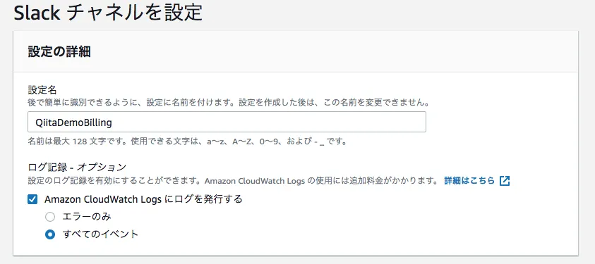

Slack チャンネルはパブリックにしておきます。

アクセス権限も適当に選択しておきます。


通知オプションは SNS で作成したものを使います。

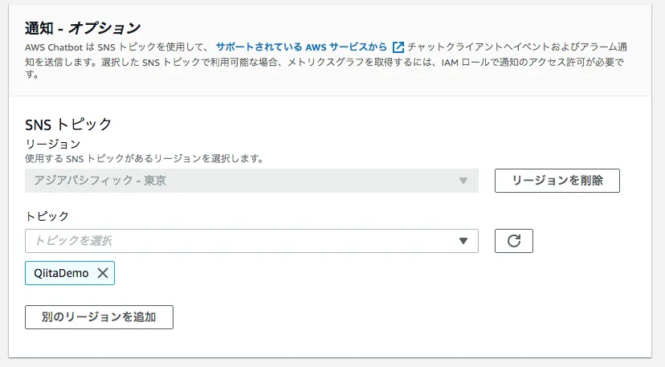

## AWS Budgets から『予算を作成』に戻る

SNS の設定で、作成した ARN を貼り付けます。

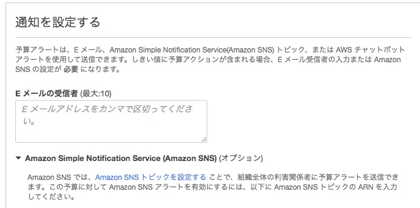

予算を 1$にし、アラート通知を 1%にすれば、通知のテストができます。
こんな感じで Slack に通知がきます (AWS は自動でメンバーに追加されます)。

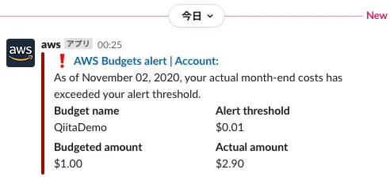

AWS Budgets が SNS を push する。
AWS Chatbot が SNS の push を検知して、Slack に通知を送る... って感じですね。

# LINE Bot を設定しよう！

一応、Slack で通知できましたが、念のため、LINE Bot の設定もしておきます。
その前に、Lambda を作りましょう！

## Lambda の設定

Node.js が好きなので、Node で作ります。


SNS でトリガーして、Lambda が動くようにします。


Lambda に何が来るかわからないので、console.log で確認してみます。
コードを変更したら、**Deploy**を忘れずに！

```js
exports.handler = async event => {
  console.log("AWS Budgets Test")
  console.log(event)
  console.log(JSON.stringify(event))
  // TODO implement
  const response = {
    statusCode: 200,
    body: JSON.stringify("Hello from Lambda!"),
  }
  return response
}
```

CloudWatch では以下が返ってきました。
大雑把な値を知りたい場合は、AWS Budgets で設定する予算名に値段を入れておくと良さそうです (Sns の Subject で取れます)。
詳細を取り出したい場合は、Message を使います。/n とか入ってますが、LINE がいい感じに整形するので、そのまま投げても大丈夫です。

```yaml
{
  "Records":
    [
      {
        "EventSource": "aws:sns",
        "EventVersion": "1.0",
        "EventSubscriptionArn": "xxx",
        "Sns":
          {
            "Type": "Notification",
            "MessageId": "xxx",
            "TopicArn": "xxxx",
            "Subject": "AWS Budgets: <AWS Budgetsで設定した予算名> has exceeded your alert threshold",
            "Message": "xxxxxxxx",
            "Timestamp": "2020-11-02T15:43:38.009Z",
            "SignatureVersion": "1",
            "Signature": "xxxxx",
            "SigningCertUrl": "xxxx",
            "UnsubscribeUrl": "xxxx",
            "MessageAttributes": {},
          },
      },
    ],
}
```

どちらにせよ、以下で Subject と Message が取れることがわかります。
Deploy して、テストしましょう！

```js
exports.handler = async event => {
  console.log("AWS Budgets Subject")
  console.log(event.Records[0].Sns.Subject)
  console.log("AWS Budgets Contents")
  console.log(event.Records[0].Sns.Message)
  // TODO implement
  const response = {
    statusCode: 200,
    body: JSON.stringify("Hello from Lambda!"),
  }
  return response
}
```

上記の CloudWatch の結果をコピーし、テストをクリックします (SNS のテンプレートを選んで使っても大丈夫です！)。

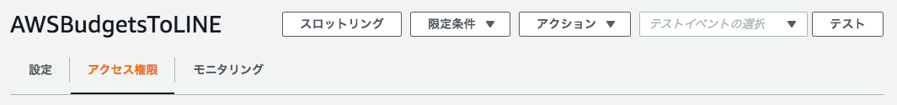

新しいテストイベントを作成し、先ほどの CloudWatch の結果を貼り付けます。

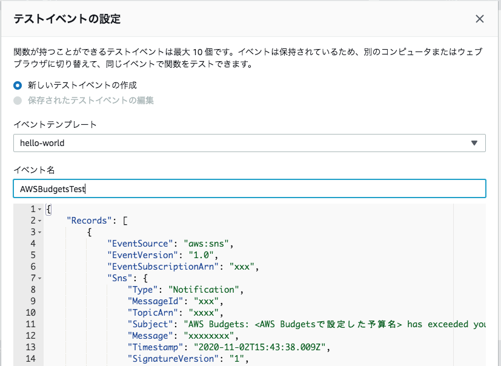

再度テストをクリックすると、テストが実行され、結果が見れます。

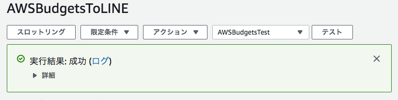

必要な値だけ取れてますね！


## LINE Bot の設定

developer コンソールにログインします。
https://developers.line.biz/console/

(本筋とは離れますが、LINE が WebAuthn 対応していて驚きました)

ログインして、Provider を作成します。

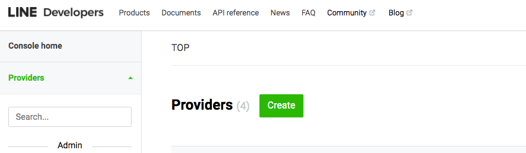

LINE Bot に予算アラートを喋らせるので、Messaging API を選びます。

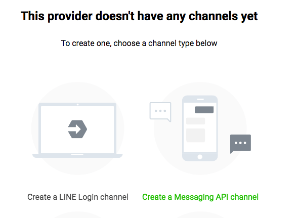

カテゴリなどを適当に設定しておきます。
設定が終わると、この画面になります。
Basic Setting の一番下にシークレットアクセスキーとユーザー ID、Messaging API にアクセスキーがあるので、控えておきます。


## Lambda に反映

ローカルの適当なディレクトリで、以下のコマンドを実行します。

```bash
$ touch index.js
$ yarn init
$ yarn add @line/bot-sdk
```

ディレクトリ構成はこんな感じです。

```bash
lambda_test
 ├── apis
 |    └── line.js
 ├── index.js
 ├── package.json
 ├── node_modules/
 └── yarn.lock
```

line.js は次のようにします。

```javascript:title=apis/line.js
"use strict"

const line = require("@line/bot-sdk")
const configs = {}

if (process.env.LINE_CHANNEL_TOKEN && process.env.LINE_CHANNEL_SECRET) {
  configs.channelAccessToken = process.env.LINE_CHANNEL_TOKEN
  configs.channelSecret = process.env.LINE_CHANNEL_SECRET
} else {
  console.warn("LINE Channel Token or Secret Token is missing...")
}

module.exports = new line.Client(configs)
```

index.js はこうします。
lineClient の処理は await を付けないと、メッセージを送る前に Lambda が終了してしまうので、気をつけましょう。

```javascript:title=index.js
"use strict"

exports.handler = async event => {
  const lineClient = require("../images/apis/line")
  console.log("AWS Budgets Subject")
  await lineClient.pushMessage(process.env.USER_ID, {
    type: "text",
    text: event.Records[0].Sns.Subject,
  })
  console.log("AWS Budgets Contents")
  await lineClient.pushMessage(process.env.USER_ID, {
    type: "text",
    text: event.Records[0].Sns.Message,
  })

  // TODO implement
  const response = {
    statusCode: 200,
    body: JSON.stringify("Hello from Lambda!"),
  }
  return response
}
```

作成した以下のファイルを zip 化し、Lambda にデプロイします。

```bash
lambda_test
 ├── apis
 |    └── line.js
 ├── index.js
 ├── package.json
 ├── node_modules/
 └── yarn.lock
```

先ほどのように Lambda でテストをしたり、適当な予算を作ってみたりすると、LINE にもアラートが飛ぶようになります。

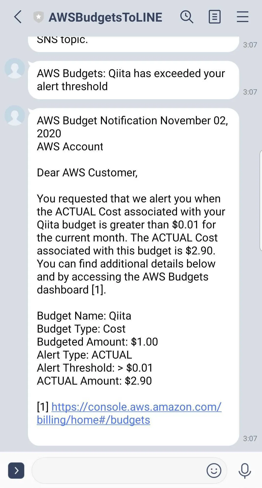

# 総括

これで、設定した予算よりも利用料が超えそうになると、Slack と LINE にメッセージが飛ぶようになりました。
