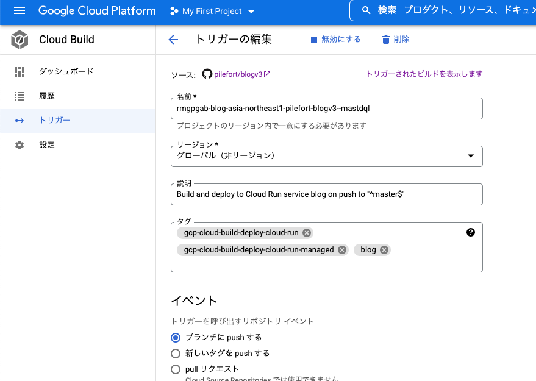
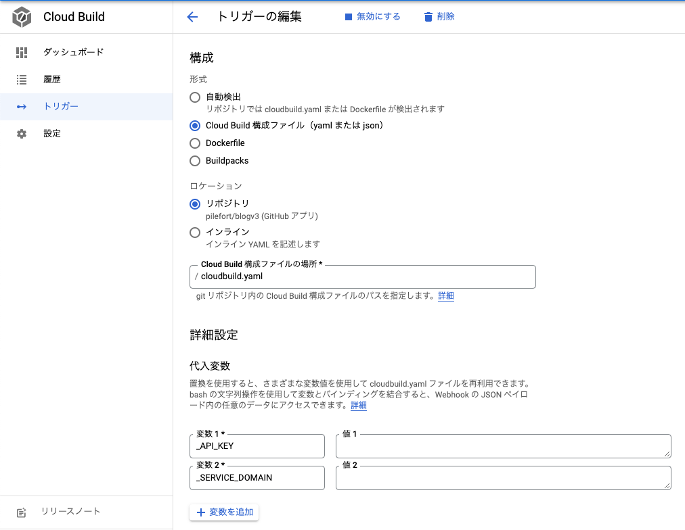

# 対象読者
- Vercel以外でNext.js (SSR) のアプリを動かしてみたい方
- GCPのCloud Run上にコンテナアプリをデプロイしてみたい方

# はじめに
Cloud RunはAWSでいうところのAWS App Runnerのようなサービスで、比較的安価にコンテナアプリを動かすためのサービスです。

本記事では、コンテナをGoogle Cloud Buildでビルドし、ビルドしたものをCloud Runにデプロイします。

# Dockerfileの準備
Dockerfile側は特に特殊な設定は不要です。

実際にDockerを動かしてみて、3000ポートにアクセスできれば、準備完了です。

```dockerfile:Dockerfile
FROM node:16-alpine

RUN apk add --no-cache libc6-compat

WORKDIR /app

COPY package.json yarn.lock ./
RUN yarn install --frozen-lockfile

COPY . .

ENV NODE_ENV production
RUN yarn build

EXPOSE 3000

ENV PORT 3000

CMD ["yarn", "start"]
```

# Code Buildの準備
あらかじめGCP側でCode Buildを準備しておきます。

ここで、連携するGitHubの設定やブランチやタグをpushしたときに、Code Buildを実行するように設定できます。



構成については、「Code Build 構成ファイル (yaml または json)」を指定します。

環境変数を設定する場合は「代入変数」という箇所に「 _ 」付きで追加します。



## codebuild.yamlの準備
[公式](https://cloud.google.com/build/docs/build-config-file-schema)を確認しながら、以下のように設定します。

```yaml:codebuild.yaml
steps:
  # 環境変数の設定
  - name: node:16.15.0
    entrypoint: yarn
    args: [ "run", "create-env" ]
    env:
      - 'API_KEY=${_API_KEY}'
      - 'SERVICE_DOMAIN=${_SERVICE_DOMAIN}'
  # ビルド
  - name: 'gcr.io/cloud-builders/docker'
    args: ['build', '-t', 'gcr.io/$PROJECT_ID/サービス名:$COMMIT_SHA', '.']
  # Container Registryにデプロイ
  - name: 'gcr.io/cloud-builders/docker'
    args: ['push', 'gcr.io/$PROJECT_ID/サービス名:$COMMIT_SHA']
  # Cloud Runにデプロイ
  - name: 'gcr.io/google.com/cloudsdktool/cloud-sdk'
    entrypoint: gcloud
    args:
      - 'run'
      - 'deploy'
      - 'サービス名'
      # 誰でもアクセスできるように設定
      - '--allow-unauthenticated'
      - '--image'
      - 'gcr.io/$PROJECT_ID/サービス名:$COMMIT_SHA'
      - '--region'
      - 'asia-northeast1'
  # 最小起動インスタンスを設定
  - name: 'gcr.io/google.com/cloudsdktool/cloud-sdk'
    entrypoint: gcloud
    args:
      - 'run'
      - 'services'
      - 'update'
      - 'サービス名'
      - '--min-instances'
      - '1'
      - '--region'
      - 'asia-northeast1'
timeout: "1600s"
images:
  - 'gcr.io/$PROJECT_ID/サービス名:$COMMIT_SHA'
```

## 環境変数の設定 - codebuild.yamlの準備
nameはクラウドビルダー (使用するコンテナ) を指定するために使います。

以下ではCloud Buildに登録した環境変数をコンテナ内で使用するための設定です。

```yaml
  - name: node:16.15.0
    entrypoint: yarn
    args: [ "run", "create-env" ]
    env:
      - 'API_KEY=${_API_KEY}'
      - 'SERVICE_DOMAIN=${_SERVICE_DOMAIN}'
```

package.jsonでは以下のようになってます。

```json:package.json
{
  "name": "sample",
  "version": "0.1.0",
  "private": true,
  "scripts": {
    "dev": "next dev",
    "build": "next build",
    "start": "next start",
    "create-env": "printenv > .env"
  },
  "dependencies": {
    ...
  },
  "devDependencies": {
    ...
  }
}
```

## ビルド - codebuild.yamlの準備
`gcr.io/cloud-builders/docker`を使用してビルドします。

サービス名は適当で大丈夫です。

$PROJECT_IDや$COMMIT_SHAは自動で値が入ります。

```yaml
- name: 'gcr.io/cloud-builders/docker'
  args: ['build', '-t', 'gcr.io/$PROJECT_ID/サービス名:$COMMIT_SHA', '.']
```

## デプロイ - codebuild.yamlの準備
コンテナレジストリへデプロイし、gcloudを使ってCloud Runにデプロイします。

デフォルトだと、未認証ユーザーのアクセスが制限されるので、gcloudの引数に`--allow-unauthenticated`を設定しておきます。

```yaml:codebuild.yaml
  # Container Registryにデプロイ
  - name: 'gcr.io/cloud-builders/docker'
    args: ['push', 'gcr.io/$PROJECT_ID/サービス名:$COMMIT_SHA']
  # Cloud Runにデプロイ
  - name: 'gcr.io/google.com/cloudsdktool/cloud-sdk'
    entrypoint: gcloud
    args:
      - 'run'
      - 'deploy'
      - 'サービス名'
      # 誰でもアクセスできるように設定
      - '--allow-unauthenticated'
      - '--image'
      - 'gcr.io/$PROJECT_ID/サービス名:$COMMIT_SHA'
      - '--region'
      - 'asia-northeast1'
```

## Cloud Runの設定
デフォルトは最小インスタンスがゼロなので、`--min-instances`で値を設定しておきます。

その他、ビルドのタイムアウトなどを設定しておきます。

```yaml
  # 最小起動インスタンスを設定
  - name: 'gcr.io/google.com/cloudsdktool/cloud-sdk'
    entrypoint: gcloud
    args:
      - 'run'
      - 'services'
      - 'update'
      - 'サービス名'
      - '--min-instances'
      - '1'
      - '--region'
      - 'asia-northeast1'
timeout: "1600s"
images:
  - 'gcr.io/$PROJECT_ID/サービス名:$COMMIT_SHA'
```

## 参考
[cloudbuild.yamlの書き方](https://cloud.google.com/build/docs/build-config-file-schema)

[クラウドビルダーについて](https://cloud.google.com/build/docs/cloud-builders)

[未認証アクセスの許可](https://cloud.google.com/run/docs/authenticating/public?hl=ja)

[Cloud Run最小インスタンスの設定](https://cloud.google.com/run/docs/configuring/min-instances)

# おわり
以上で設定完了です。

Cloud RunのAPIを有効化し、ビルドを走らせるとデプロイできるようになります。
